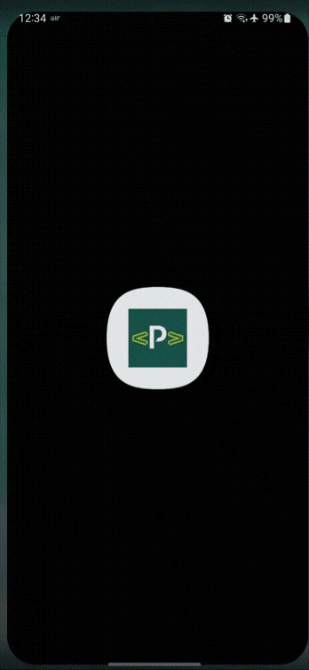
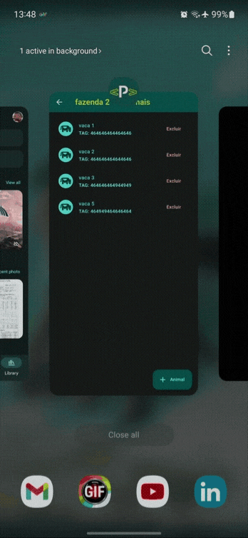
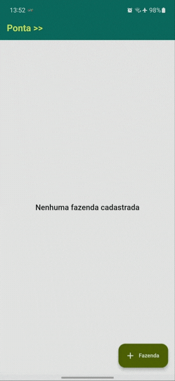
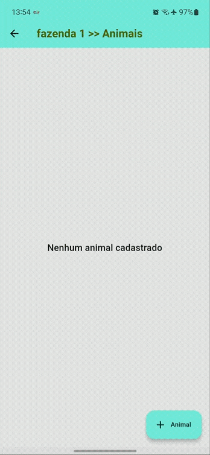

# Ponta >> 🤠 🚜 🐄

This project enables the user to manage their farm animals. It uses SQL database for storage and BLoC for state management.

## Getting Started

- 1 - Make sure you have [Flutter SDK 3.10.5](https://flutter.dev/) seted up and running on your machine;
- 2 - Clone this repository using:
```bash
git clone https://github.com/mariugo/pontaagro.git
```
- 3 - Make sure all dependencies are installed:
```bash
flutter pub get
```
- 4 - The minimum Android SDK is 26, so make sure your device or emulator is on this version or above, then run:
```bash
flutter run
```
## 📱Screens
<div align="center">
   </img>
   </img>
  </br>
  </br>
    </img>
   </img>
</div>

## 🛠 Technology 🚀

This project is build on the principles of Clean Architecutre and SOLID consequently, so it's easily maintened, testable and scalable.
Also a quick [Google Ngram Search](https://books.google.com/ngrams/graph?content=clean+architecture&year_start=2000&year_end=2019&corpus=en-2019&smoothing=3) display in the last 19 years a rise in usage, not
to mention a Github or Stackoverflow search.
Because it's a mobile app, it follows also a feature-first aproach.

###### So it feature 3 main layers:
**PRESENTATION**
It features 3 main layers related to the rendering of the data on the screen:
- Widgets: Contains in Flutter, relevant custom Widgets to the Pages layer >>
- Pages: Contains the UI of the application and calls the next layer for data >>
- Controller: Contains all bussiness logic and calls to other data layers, but independently of state management of choice, it's role is to send data to the presentation layer.

**DOMAIN**
It features 3 main layers that are related to the bussiness logic of the application. It is normally written in pure Dart (in this case) without outside dependencies:
- Entities: Contains a representation of a data strucutre with no dependancy of outside layers.
- Repository: Contains the interfaces of repositories, in this case there's only a local one not remote, but it could be easily implemented.
- UseCases: Contains either the interface of usecases with generics on <R, P> return and params call or the actual implementation, calling the upper layer, the repository.

**DATA**
It is responsible for data storage and retrieval, also object conversion to other data structure, also repository implementations.
- Models: Contains a representation of a data strucutre in JSON, but it could be converted to XML or any other data type with no conflicts.
- Repository: Contains repositories implementations of interfaces in this case calls to the local database.

#### So data flow follows: 
<pre>
PAGE >> 
        CONTROLLER >> 
                      USECASE >> 
                                REPOSITORY >> 
                                              DATABASE << DATAMODEL
</pre>

## 💻 About
Besides the architecture chosen, it features specific files for:

- Dependency Injection (*locator.dart*) [Get It](https://pub.dev/packages/get_it) using a Singleton Design Pattern.
- Route Management (*routes.dart*) [Go Router](https://pub.dev/packages/go_router) 💙
- State Management (*controllers and states.dart*) [Flutter BLoC](https://pub.dev/packages/flutter_bloc) 💙
- Mock Tests, specially for using local storage is needed, provided by [Mockito](https://pub.dev/packages/mockito).
- White and Dark Theming.
- GitHub Actions :octocat: for CI, running tests, analyzers and others on (*ci.yaml*)
- Theming (*app_colors, app_text_theme.dart*) with colors and styles inspired by [Material Design 3](https://m3.material.io/) Design System.
- Extensions and Mixins (*size_extensions, loader, snackbar.dart*) to facilitate, keep it responsible and DRY's principle and others found here: [IT Acronyms](https://areknawo.com/10-coding-principles-and-acronyms-demystified/).

The code itself doesn't contain comments as I tried to make it 💋KISS and follow Clean Code Principles. I do believe it is extremely readable and understandable 😊 Nevertheless there's still room for
improvement, using for instance String capitalizations via extensions, internalization and so on.

---
Made with ♥ by Mariugo 🚀
